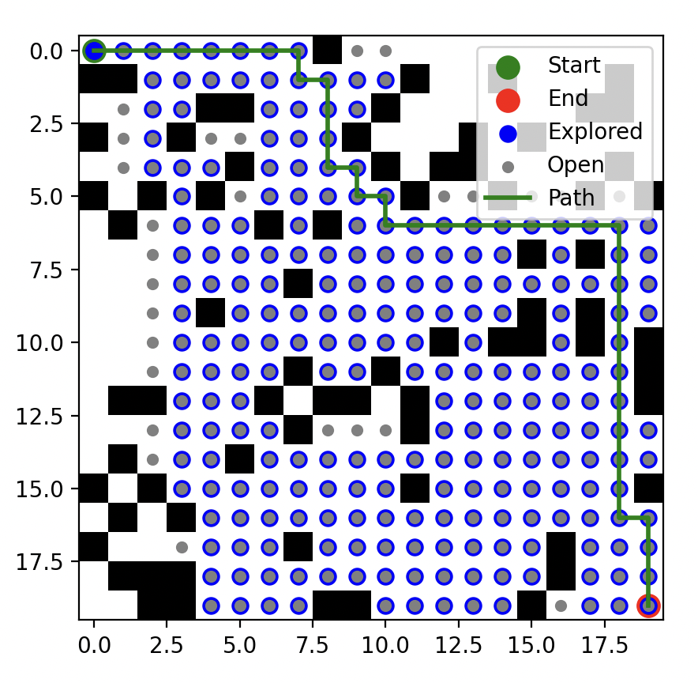

# Algoritmo A* (A-estrela)

O algoritmo **A\*** (A-estrela) é uma técnica amplamente usada para encontrar o menor caminho entre **dois pontos em um grafo**, como em mapas ou jogos. Ele combina o **custo real** para chegar a um nó com uma **heurística** que estima o custo restante até o destino.

O A* busca explorar primeiro os nós que parecem **mais promissores**, guiando-se pela **heurística** definida, o que geralmente torna a busca mais eficiente do que o algoritmo de Dijkstra.


> **Entendendo**: https://www.101computing.net/a-star-search-algorithm/
> **Visualização**: https://pathfindout.com/


**Pontos Fortes:**

1. **Eficiência**: O A* é eficiente, pois usa uma heurística para guiar a busca, explorando apenas os caminhos que parecem mais promissores, evitando explorar áreas irrelevantes do grafo.

2. **Flexibilidade**: Ele pode ser ajustado com diferentes heurísticas, o que o torna flexível para diferentes tipos de problemas.

3. **Ótimo para ambientes espaciais**: Em mapas ou jogos 2D, onde existe uma clara relação espacial, a heurística baseada na distância (como distância de Manhattan ou euclidiana) geralmente oferece excelentes resultados.

**Pontos Fracos:**

1. **Escolha da heurística**: O sucesso do A* depende muito da escolha de uma boa heurística. Se a heurística não for precisa (subestima o custo real), o algoritmo pode se tornar ineficiente ou até mesmo retornar um caminho incorreto.

2. **Custos variáveis**: Em cenários onde o custo das arestas muda dinamicamente, o A* pode precisar de ajustes ou reexecuções constantes.

3. **Alto uso de memória**: A estrutura do A* requer manter listas abertas e fechadas, o que pode se tornar problemático em grandes grafos ou em sistemas com memória limitada.


## Código de Exemplo

Para executar o código de exemplo, garanta que tenha o poetry instalado em seu ambiente. Caso não tenha, siga as instruções em: https://python-poetry.org/docs/

Em seguida, execute os seguintes comandos:

```bash
poetry install
poetry run python grafos.py
```

